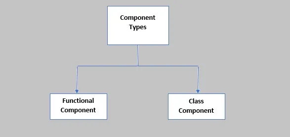

# What Is Component .

**A component is a reusable piece of UI that can be composed together to create complex user interfaces. Components can be thought of as custom HTML elements that are defined by JavaScript code.**


<!--  -->

## React components can be two types :

> function Component

> class Component

<hr>


## React Function Component [ rfce ]

```
import React from 'react'
function Hello() {
  return (
    <div>Hello</div>
  )
}

export default Hello

```
## React Arrow Function Conponent [ rafc ] [ rafce ]

```
import React from 'react'

const Hello = () => {
  return (
    <div>Hello</div>
  )
}

export default Hello

```
## ## {props.children}

<hr>

# React Component

> class component

> constructor()

> super() 

> render()

> user define method

## React Class Component [ rcc ] [ rce ]

```
import React, { Component } from 'react'

export default class Hello extends Component {
  render() {
    return (
      <div>Hello</div>
    )
  }
}


```

## React class Component with props and state

```
import React, { Component } from 'react'

export default class Welcome extends Component {
    constructor(props) {
      super(props)
    
      this.state = {
         user :"Guest"
      }
    }
    clickHandler=()=>{
        this.setState({user:"User Profile"})
        // console.trace("Test The Handler");
    }
  render() {
    return (
      <div>
        <h1>Welcome {this.props.test} {this.state.user}</h1>
        <button onClick={this.clickHandler}>Login</button>
    </div>
    )
  }
}

<Welcome test="Punit"/>


```


