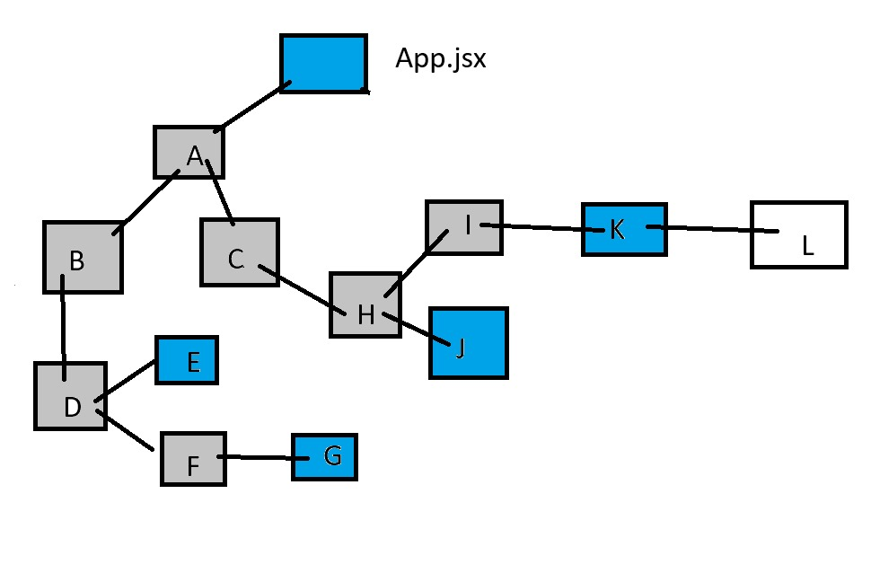

# useContext() hook

**The useContext hook is used in React to consume values from a context provider. It allows functional components to access the data and functions provided by a context without the need for prop drilling.**



<hr>

**React Context lets you share state (or any data) across your entire app without having to manually pass props down at every level.
It’s like a global variable for a part of your React component tree.**

<hr>

## 1. creacteContext()

**makes a new context ( container ) to store the value**

```
export const UserContext = React.createContext()

```

## 2. Provider

**A component that wraps parts of the app and provides the value to them**

```
<UserContext.Provider value={'Punit'}>
    <Acomp />
</UserContext.Provider>
```

## 2. useContext() 

**A hook to access the current value inside a component **

```
import { UserContext} from '../App'

const user = useContext(UserContext)

{user}

```

## 3. another way to use

```
import { UserContext} from '../App'

 <UserContext.Consumer>
                {
                    user => {
                       return <div>User Context Value {user}</div>
                            }
                }
</UserContext.Consumer>
```


